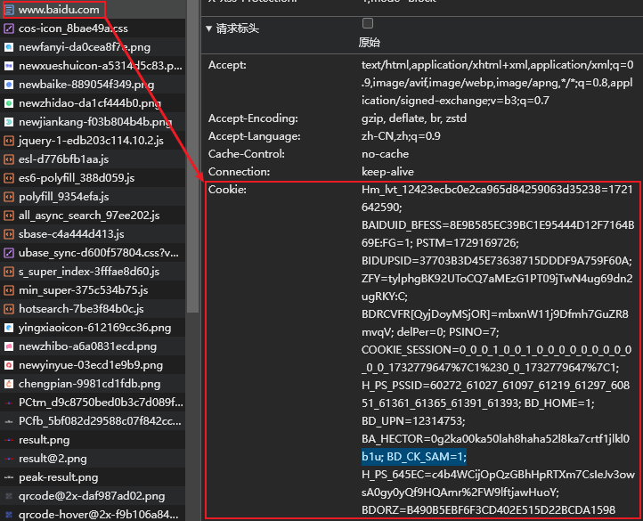
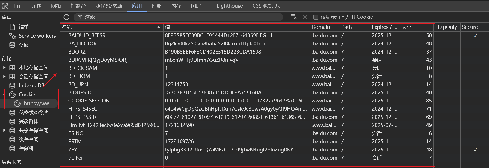
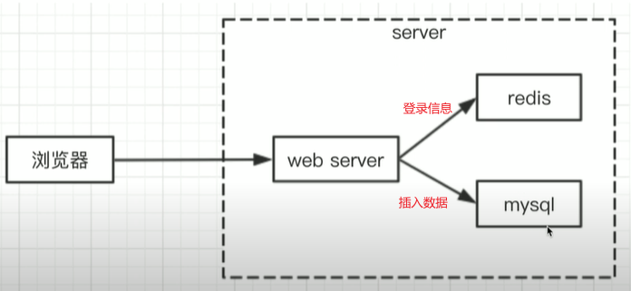
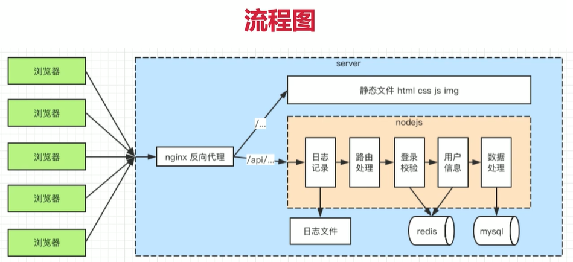
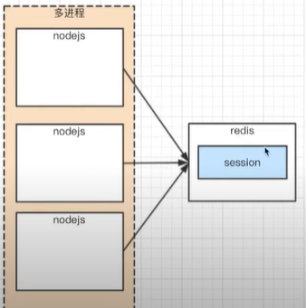

- [nodejs](#nodejs)
  - [nodejs 与 JavaScript 的区别](#nodejs-与-javascript-的区别)
  - [项目结构](#项目结构)
  - [mysql](#mysql)
  - [cookie](#cookie)
  - [session](#session)
  - [redis](#redis)
  - [nginx](#nginx)
  - [日志](#日志)
    - [目录](#目录)
    - [nodejs 文件操作](#nodejs-文件操作)
    - [IO 操作的性能瓶颈](#io-操作的性能瓶颈)
      - [Stream](#stream)
    - [日志拆分](#日志拆分)
      - [crontab（定时任务工具）](#crontab定时任务工具)
      - [日志分析](#日志分析)
  - [安全](#安全)
    - [mysql 中提供了 `escape`函数](#mysql-中提供了-escape函数)
  - [XSS 攻击](#xss-攻击)
  - [密码加密](#密码加密)
  - [流程图](#流程图)
  - [前后端启动 连接并联调流程](#前后端启动-连接并联调流程)
    - [启动后端](#启动后端)
- [使用 express](#使用-express)
  - [安装使用](#安装使用)
  - [express 中间件](#express-中间件)
  - [express session](#express-session)
  - [express 连接到 redis](#express-连接到-redis)
  - [mrogen 日志](#mrogen-日志)
- [koa2](#koa2)
  - [实现登录 基于 koa-generic-session 和 koa-redis](#实现登录-基于-koa-generic-session-和-koa-redis)
  - [koa 日志](#koa-日志)
  - [koa2 中间件](#koa2-中间件)
- [线上环境](#线上环境)
  - [PM2](#pm2)
    - [PM2 学习目录](#pm2-学习目录)
      - [PM2 介绍](#pm2-介绍)
      - [进程守护](#进程守护)
      - [PM2 配置和守护](#pm2-配置和守护)
      - [PM2 多进程](#pm2-多进程)
      - [关于运维](#关于运维)

# nodejs

## nodejs 与 JavaScript 的区别

- ECMAScript
  是语法规范
- nodejs
  ECMAScript+nodejs api
- commonjs
- nodejs debugger

## 项目结构

```bash
.
├── app.js                                                      # 基础设置相关逻辑
├── package.json                                                # 依赖包
└── bin
    ├── www.js                                                  # 创建Server相关逻辑
└── src
    ├── controller                                                # controller
    │   ├── blog.js                                                   # 博客
    │   └── user.js                                                   # 用户
    ├── model                                                   # 数据库model目录
    │       ├── resModel.js                                           # 定义返回数据的模型
    ├── router                                                    # 路由
    │    ├── index.js                                                 # 路由模块集合
    │    └── modules                                                  # 路由模块
    │       ├── blog.js                                                  # blog 的路由
    │       └── user.js                                                  # user 的路由

```

## mysql

> 可视化工具[https://dev.mysql.com/downloads/workbench/]

查询所有数据库
`show databases`

创建 blog 数据库

```sql
CREATE SCHEMA `myblog` ;
```

创建用户表

```sql
CREATE TABLE `myblog`.`users` (
  `id` INT NOT NULL AUTO_INCREMENT,
  `username` VARCHAR(20) NOT NULL,
  `password` VARCHAR(20) NOT NULL,
  `realname` VARCHAR(10) NOT NULL,
  PRIMARY KEY (`id`));

```

创建 blog 表

```sql
CREATE TABLE `myblog`.`blogs` (
  `id` INT NOT NULL AUTO_INCREMENT,
  `title` VARCHAR(50) NOT NULL,
  `content` LONGTEXT NOT NULL,
  `createtime` BIGINT(20) NOT NULL,
  `author` VARCHAR(20) NOT NULL,
  PRIMARY KEY (`id`));

```

增加一个字段

```sql
ALTER TABLE `myblog`.`users`
ADD COLUMN `state` INT NOT NULL DEFAULT 1 AFTER `realname`;
```

删除一个字段

```sql
ALTER TABLE `myblog`.`users`
DROP COLUMN `state`;

```

```sql
-- 插入user数据
insert into users(username,`password`,realname) values('zhangsan','123','张三');
insert into users(username,`password`,realname) values('lisi','123','李四');
-- 查询user表数据
select * from users;
select id,username from users;
select * from users where username = 'zhangsan' and `password` = '123';
select * from users where username like '%zhang%';
select * from users where password like '%1%' order by id desc;

-- 更新user
-- update users set realname = '李四2' where username='lisi';
-- Error Code: 1175.  You are using safe update mode and you tried to update a table without a WHERE that uses a KEY column.   To disable safe mode, toggle the option in Preferences -> SQL Editor and reconnect.
-- 禁用安全模式
SET SQL_SAFE_UPDATES = 0;
update users set realname = '李四2' where username='lisi';

-- 删除
delete from users where username='lisi';
-- 开发中删除 示例：软删除
update users set state = 1 where username='lisi';
select * from users where state <> 0;
```

添加 blogs 测试数据

```sql
select * from blogs order by createtime desc;
insert into blogs(title,content,createtime,author) values('标题A','内容A',1733909793093,'zhangsan');
insert into blogs(title,content,createtime,author) values('标题B','内容B',1733909871598,'lisi');
```

mqsql 新特性 varchar(10) 数据类型

> 以前中文字符占两个长度 英文字符占一个长度 ,在 >=5 以上的版本都统一化了 中文字符也占一个长度

```sql
select version();
-- 8.4.0
```

- 根据 NODE_ENV 区分配置

```json
// package.json
"dev": "cross-env NODE_ENV=dev nodemon bin/www.js",
"prod": "cross-env NODE_ENV=prod nodemon bin/www.js"
```

```js
// src/config/db.js
// 配置
let MYSQL_CONF;

if (env === "dev") {
  MYSQL_CONF = {
    host: "localhost",
    user: "root",
    password: "000000",
    port: "3306",
    database: "myblog",
  };
}

if (env === "prod") {
  MYSQL_CONF = {
    host: "localhost",
    user: "root",
    password: "000000",
    port: "3306",
    database: "myblog",
  };
}
```

> pnpm dev -- 运行后处于开发模式

- 封装 exec 函数，API 使用操作数据库

```js
const mysql = require("mysql2");
const { MYSQL_CONF } = require("../config/db");

// 创建连接对象
const con = mysql.createConnection(MYSQL_CONF);

// 开始连接
con.connect();

// 统一执行 sql 的函数
function exec(sql) {
  return new Promise((resolve, reject) => {
    con.query(sql, (err, result) => {
      if (err) {
        reject(err);
        return;
      }
      resolve(result);
    });
  });
}

module.exports = { exec };
```

## cookie

- 什么时 cookie
  1. 存储在浏览器中的一段字符串（最大 5kb）
  2. 跨域不共享
  3. 格式如 k1=v1;k2=v2;k3=v3; 因此可以存储结构化数据
  4. 每次发送 http 请求，会将请求域的 cookie 一起发送给 server
  5. server 端可以修改 cookie 并返回给浏览器
  6. 浏览器中也可以通过 javascript 修改 cookie（有限制）
- javascript 操作 cookie,浏览器中查看 cookie
  - 客户端查看 cookie 三种方式
    1. 
    2. 
    3. 
  - javascript 查看、修改 cookie（有限制）
    1. 做累加(会追加到 cookie 值的后边)
       document.cookie = 'k1=100;'
- server 端操作 cookie,实现登录验证

  - 查看 cookie

    ```js
    // 解析 cookie
    const cookieStr = req.headers.cookie || ""; // k1=v1;k2=v2;k3=v3
    req.cookie = {}; // 用来存储cookie
    cookieStr.split(";").forEach((item) => {
      if (!item) {
        return;
      }

      const arr = item.split("=");
      const key = arr[0];
      const val = arr[1];
      req.cookie[key] = val;
    });
    console.log("req.cookie--", req.cookie);
    ```

  - 修改 cookie

    ```js
    // 操作 cookie  before
    res.setHeader("Set-Cookie", `username=${data.username}; path=/;`);

    // 限制前端修改cookie after
    // 操作 cookie  path=/ 表示根目录下都可以访问  httpOnly 表示只能通过后端修改
    // 操作 cookie  path=/ 表示根目录下都可以访问  httpOnly 表示只能通过后端修改 expires 表示过期时间
    res.setHeader(
      "Set-Cookie",
      `username=${
        data.username
      }; path=/; httpOnly; expires=${getCookieExpires()}`
    );
    ```

  - 实现登录验证

    ```js
    // 登录验证的测试   -- http://localhost:8000/api/user/login-test
    if (method === "GET" && req.path === "/api/user/login-test") {
      if (req.cookie.username) {
        return Promise.resolve(
          new SuccessModel({ username: req.cookie.username })
        );
      }
      return Promise.resolve(new ErrorModel("尚未登录"));
    }
    ```

- 全选单个函数名称 ctrl + D

## session

cookie 中一般不存储明文相关信息，并且 cookie 只能存储 5kb 数据
session 的理解：根据不同的浏览器请求 server 的会话，server 端会保存不同的值`req.session`

解决：
cookie 中存储 userid,server 端对应 username,因为 server 端没有数据大小限制

- 使用 session 存在的问题

目前 session 直接是 js 变量,放在 nodejs 进程内存中

```js
// session 数据
const SESSION_DATA = {};

// 解析 session
let needSetCookie = false;
let userId = req.cookie.userid;

// 已登录
if (userId) {
  if (!SESSION_DATA[userId]) {
    SESSION_DATA[userId] = {};
  }

  console.log("SESSION_DATA--", SESSION_DATA);
} else {
  // 未登录
  needSetCookie = true;
  userId = `${Date.now()}_${Math.random()}`;
  SESSION_DATA[userId] = {};
}
req.session = SESSION_DATA[userId];
```

1. 进程内存有限，访问量过大，内存暴增怎么办？
2. 正式线上环境是多进程，进程直接内存无法共享

问题的根源来自于 session 数据目前储存在进程的内存中 如果数据过大 内存会被挤爆

解决方案 redis（及 redis 使用场景）

- 为什么 session 适合用 redis?
  1. session 访问频率高，对性能要求高
  2. session 可不考虑断电丢失数据问题（内存的硬伤）
  3. session 数据量不会很大（相比于 mysql 中存储的数据）
- 为什么网站数据不适合用 redis?
  1. 操作频率不是太高（相比于 session 操作）
  2. 断电不能丢失，必须保留(只适合保存到硬盘数据库中)
  3. 数据量太大，内存成本过高

## redis

- web server 最常用的缓存数据库，数据放在内存中
- 相比 MySQL，访问速度快（内存和硬盘不是一个数量级的）
- 但是成本更高，可存储的数据量更小（内存的硬伤 ）
  

- Windows [http://www.runoob.com/redis/redis-install.html]
- Mac 使用 `brew install redis`

- 启动 redis-server.exe
  
- 运行 redis-cli

```shell
D:\software\Redis-x64-5.0.14.1>redis-cli.exe
127.0.0.1:6379> set mykey abc
OK
127.0.0.1:6379> get mykey
"abc"
127.0.0.1:6379>
```

- 操作 redis
  `set [key] [value]`
  `get [key]`
  `keys *`
  `del [key]`

- 双击闪退问题
  cmd 进入 redis 所在目录 执行 `redis-server.exe redis.windows.conf`

## nginx

场景：

- 登录功能依赖 cookie,必须使用浏览器联调
- cookie 跨域不共享，前端和 server 端必须同域(都在本地用一个端口会导致一方不能运行)
- 需要用到 nginx 做代理，让前后端同域

介绍：

- 高性能的 web 服务器，开源免费
- 一般用于做静态服务器、负载均衡
- 反向代理（该 demo 使用到）

下载安装：

- windows [http://nginx.org/en/download.html]
- mac `brew install nginx`

> 配置文件
> windows: C:\nginx\conf\nginx.conf
> mac: /usr/local/etc/nginx/nginx.conf

测试配置文件格式是否正确

> `nginx -t`

启动

> `nginx.exe` or `start nginx` > 

重启

> `nginx.exe -s reload`

停止

> `nginx.exe -s stop`

- nginx 文件配置

```conf
server {
  listen       8888;
  server_name  localhost;

  # ...
  location / {
      proxy_pass http://localhost:8001;
  }

  location /api/ {
      proxy_pass http://localhost:8000;
      proxy_set_header Host $host;

      # 添加跨域支持
      add_header Access-Control-Allow-Origin *;
      add_header Access-Control-Allow-Methods GET,POST,PUT,DELETE,OPTIONS;
      add_header Access-Control-Allow-Headers Content-Type,Authorization;

      # 处理 OPTIONS 请求
      if ($request_method = 'OPTIONS') {
          add_header Access-Control-Allow-Origin *;
          add_header Access-Control-Allow-Methods GET,POST,PUT,DELETE,OPTIONS;
          add_header Access-Control-Allow-Headers Content-Type,Authorization;
          return 204;
      }
  }
}
```

> `listen 8888;` 监听一个代理的端口
> `server_name  localhost;` 服务器 ip 或者域名

```conf
location / {
  proxy_pass http://localhost:8001;
}
```

> 配置 `/` 需要代理到的地址 "这里指前端地址"

```conf
location /api/ {
      proxy_pass http://localhost:8000;
      proxy_set_header Host $host;
  }
```

> 配置 `/api/` 需要代理到的地址 "这里值 server"

- 测试请求
  > 前端从 8000 请求 `listen 8888;` 配置的这个端口 看是否能请求到服务端的数据 代理到 8001

## 日志

- 系统没有日志，等于人没有眼睛---抓瞎
- 第一，访问日志 access log(server 端最重要的日志)
- 第二，自定义日志(包括自定义事件，错误记录等)

### 目录

1. nodejs 文件操作，nodejs stream
2. 日志功能开发和使用
3. 日志文件拆分，日志内容分析

### nodejs 文件操作

- 日志要存储到文件中
  适合进行文件读入、写入
- 为何不存储在 mysql 中？
  硬盘数据库，不适合存储文件
- 为何不存储在 redis 中？
  内存数据库，不适合存储文件

### IO 操作的性能瓶颈

- IO 包括 “网络 IO” 和 “文件 IO”
- 相比于 CPU 计算和内存读写，IO 的突出特点就是：慢！
- 如何实现在有限的硬件资源下提高 IO 的操作效率？

#### Stream

- source
- dest

### 日志拆分

- 日志内容会慢慢积累，放在一个文件中不好处理
- 按照事件划分日志文件，如：2024-12-14.access.log
- 实现方式：linux 的 crontab 命令，即 定时任务

#### crontab（定时任务工具）

- 设置定时任务，格式：`*****` command
  > 五个`*` 从左到右表示：分钟、小时、日、月、年
  > command 表示 生成脚本
- 将 access.log 拷贝并重命名为 2024-12-14.access.log
- 清空 access.log 文件，继续积累日志

使用 git bash 控制台
到`D:\LearnFolder\front_end-path\技术应用阶段\nodejs\blog-1\src\utils` 执行 `sh copy`

```shell
#!/bin/sh
# 到指定目录
cd D:/LearnFolder/front_end-path/技术应用阶段/nodejs/blog-1/logs
# 复制文件 并重命名 为当前日期
cp access.log $(date +%Y-%m-%d).access.log
# 清空文件
echo "" > access.log
```

在 linux 服务器上：

1. 编辑 Cron 任务：

   ```bash
    crontab -e
   ```

2. 添加定时任务，例如每小时运行 copy.sh：

   ```bash
    0 * * * * /mnt/d/LearnFolder/front_end-path/技术应用阶段/nodejs/blog-1/src/utils/copy.sh
   ```

#### 日志分析

- 如针对 access.log 日志，分析 chrome 的占比
- 日志是按行存储的，一行就是一条日志
- 使用 nodejs 的 readline（基于 stream,效率高）

## 安全

- sql 注入：窃取数据库内容
- XSS 攻击：窃取前端的 cookie 内容
- 密码加密：保障用户信息安全（重要）

### mysql 中提供了 `escape`函数

```js
username = escape(username);
password = escape(password);
const sql = `
    select username, realname from users where username='${username}' and password='${password}';
  `;
```

防止这种 `where username='zhangsan' -- ' and password='123';` sql 攻击

## XSS 攻击

- 攻击方式：在页面展示内容中掺杂 js 代码，以获取网页内容
- 预防措施：转换生成 js 的特殊字符

> `pnpm add xss --save`

```js
const xss = require("xss");
...
title = xss(title);
content = xss(content);
const createTime = Date.now();

const sql = `
  insert into blogs (title, content, createtime, author)
  values ('${title}', '${content}', ${createTime}, '${author}');`;
```

## 密码加密

- 万一数据库被用户攻破，最不应该泄露的就是用户信息
- 攻击方式：获取用户名和密码，再去尝试其他系统
- 预防措施：将密码加密，即便拿到数据库密码也不知道明文

## 流程图



## 前后端启动 连接并联调流程

### 启动后端

1. `pnpm dev` [http://localhost:8000] nginx 中代理的 `/api/`
2. 启动 redis `cd C:\Program Files\Redis` 双击 `redis.server.exe`
3. 启动 nginx 让前端通过 `http://localhost:8888/api/...` 指向后端 api

# 使用 express

- express 是 nodejs 最常用的 web server 框架(类似于前端 vue、react 等)
- 什么是框架？

  1. 让开发人员专注于业务
  2. 框架有自己的一套流程
  3. 有现成的工具，不用自己写底层代码

- express 下载、安装和使用，express 中间件机制
- 开发接口，连接数据库，实现登录，日志记录
- 分析 express 中间件原理

## 安装使用

- 安装（使用脚手架 express-generator）
- 初始化代码介绍，处理路由
- 使用中间件

1. `pnpm add express-generator -g`
2. `express blog-express`
3. `pnpm i & pnpm start`

默认 3000 端口 `http://localhost:3000`

## express 中间件

函数中传递的函数就是中间件，第一个字符串参数如果没有传递定义出来的 会在下一次命中时执行例如：在浏览器访问`http://localhost:3000/api/get-cookie`,
此时会先执行 `app.use((req,res,next){})` 没有传递第一个参数的定义，然后 next()会指向 app.get(...),再执行`app.get("/api/get-cookie",...)"`相关逻辑

```js
// app.use(str,func1,func2,func3...)

app.use((req, res, next) => {
  console.log("请求开始...", req.method, req.url);
  next();
});

app.use((req, res, next) => {
  // 假设在处理 cookie
  req.cookie = {
    userId: "abc123",
  };
  next();
});

app.get("/api", (req, res, next) => {
  console.log("get /api 路由");
  next();
});

app.get("/api/get-cookie", (req, res, next) => {
  console.log("get /api/get-cookie");
  res.json({
    errno: 0,
    data: req.cookie,
  });
});
```

## express session

> `pnpm add express-session`

```js
const session = require("express-session");
...
app.use(
  session({
    secret: "WJiol_877#",
    cookie: {
      // path: "/", // 默认配置
      // httpOnly: true, // 默认配置
      maxAge: 24 * 60 * 60 * 1000,
    },
  })
);
```

## express 连接到 redis

> `pnpm add redis@3 connect-redis`

```js
const RedisStore = require("connect-redis")(session);
//...
app.use(
  session({
    store: new RedisStore({ client: redisClient }), // 使用 Redis 作为会话存储
    secret: "WJiol#23123", // 用于加密会话 ID 的密钥
    resave: false, // 避免每次请求都重新保存会话
    saveUninitialized: false, // 避免未初始化的会话被保存到存储中
    cookie: {
      secure: false, // 开发环境设置为 false，生产环境启用 HTTPS 时设为 true
      httpOnly: true, // 阻止客户端脚本访问 Cookie
      maxAge: 1000 * 60 * 60 * 24, // 会话过期时间：1 天
    },
  })
);
```

## mrogen 日志

```js
const ENV = process.env.NODE_ENV;
if (ENV !== "prod") {
  // 开发环境 / 测试环境
  app.use(logger("dev"));
} else {
  // 线上环境
  const logFileName = path.join(__dirname, "logs", "access.log");
  const writeStream = fs.createWriteStream(logFileName, {
    flags: "a",
  });
  app.use(
    logger("combined", {
      stream: writeStream,
    })
  );
}
```

# koa2

- express 中间件时异步回调，koa2 原生支持 async/await
- 新开发框架和系统，都开始基于 koa2,；例如 egg.js
- express 虽然未过时，但是 koa2 肯定是未来趋势

1. `pnpm add koa-generator -g`
2. `koa2 blog-koa2`
3. `pnpm i & pnpm start`

## 实现登录 基于 koa-generic-session 和 koa-redis

`pnpm add koa-generic-session koa-redis --save`

app.js

```js
const session = require("koa-generic-session");
const redisStore = require("koa-redis");
// logger
...
// session
app.keys = ["WJiol#23123_"];
app.use(
  session({
    // 配置 cookie
    cookie: {
      path: "/",
      httpOnly: true,
      maxAge: 24 * 60 * 60 * 1000,
    },
    // 配置 redis
    store: redisStore({
      // redis 的 ip 和端口
      all: "127.0.0.1:6379", // redis 的地址
    }),
  })
);

//routes
...
```

routes/user.js

```js
router.get("/session-test", async (ctx, next) => {
  if (ctx.session.viewCount == null) {
    ctx.session.viewCount = 0;
  }
  ctx.session.viewCount++;
  ctx.body = {
    errno: 0,
    viewCount: ctx.session.viewCount,
  };
});
```

## koa 日志

`pnpm add koa-morgan --save`

## koa2 中间件

[https://koa.bootcss.com/]

分析

1. 使用 app.use 用来注册中间件，先收集起来
2. 实现 next 机制，即上一个通过 next 触发下一个

# 线上环境

- 服务器稳定性
- 充分利用服务器硬件资源，以便提高性能
- 线上日志记录

## PM2

PM2 的核心价值

- 进程守护，系统崩溃自动重启
- 启动多进程，充分利用 CPU 和内存
- 自带日志记录功能

### PM2 学习目录

- PM2 介绍
- PM2 进程守护
- PM2 配置和守护
- PM2 多进程
- 关于服务器运维

#### PM2 介绍

1. 下载安装
   `pnpm i pm2 -g`
   `pm2 --version`
2. 基本使用

   ```json
   // package.json
   "scripts": {
     "dev": "cross-env NODE_ENV=development nodemon app.js",
     "prd": "cross-env NODE_ENV=production pm2 start app.js --name pm2-demo"
   },
   ```

   `pnpm run prd` 会启动 pm2 进程，不会占用控制台
   `pm2 list` 显示表格
   

3. 常用命令
   `pm2 start ...`,`pm2 list`
   `pm2 restart <AppName>/<id>`
   `pm2 stop <AppName>/<id>`,`pm2 delete <AppName>/<id>`
   `pm2 info <AppName>/<id>`
   `pm2 log <AppName>/<id>`
   `pm2 monit <AppName>/<id>`

#### 进程守护

- node app.js 和 nodemon app.js 进程崩溃则不能访问
- PM2 遇到进程崩溃，会自动重启

`http://localhost:8000/error`

```js
// ...
// 模拟一个错误
if (req.url === "/error") {
  throw new Error("模拟错误");
}
//...
```

`pm2 restart pm2-demo` 遇到魔力的这个错误会自动重启

#### PM2 配置和守护

- 新建 PM2 配置文件(包括进程数量，日志文件目录等)
- 修改 PM2 启动命令，重启
- 访问 server,检查日志文件的内容等(日志记录是否生效)

```json
{
  "app": {
    "name": "pm2-demo-server",
    "script": "app.js",
    "watch": true,
    "ignore_watch": ["node_modules", "logs"],
    "error_file": "logs/err.log",
    "out_file": "logs/out.log",
    "log_date_format": "YYYY-MM-DD HH:mm:ss",
    "instances": 1,
    "exec_mode": "cluster",
    "env": {
      "NODE_ENV": "development"
    },
    "env_production": {
      "NODE_ENV": "production"
    }
  }
}
```

#### PM2 多进程

为何使用多进程

- 操作系统限制一个进程的内存
- 内存： 无法充分利用机器全部内存
- CPU： 无法利用多核 CPU 的优势

多进程和 redis


- 多进程之间，内存无法共享
  通过 redis 实现内存共享 把 session 都存入 redis

#### 关于运维

- 服务器运维，一般都是由专业的 OP 人员和部门来处理
- 大公司都有自己的运维团队
- 中小型公司推荐使用一些云服务器，如 阿里云的 node 平台
