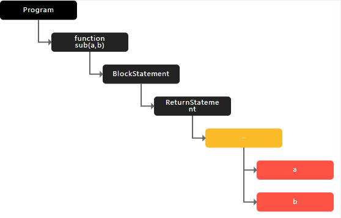

# 抽象语法树的概念

> 抽象语法树是一个非常重要的概念(Abstract Syntax Tree)AST

## 树（Tree）

树实际上是一种数据结构

例如：有一个书柜(计算机)放 10 本书(数据)，10 本书的放置是多种多样的，可以横着放 也可以竖着放，也可以斜着放。

所谓数据结构，实际上就是数据(书)在计算机（书柜）中组织和管理的一种方式，根据不同的场景，使用合适的数据结构能够帮助我们高效的对数据进行访问操作。

数据结构如果从大类上面去分类的话，可以分为两个大类：线性数据结构 和 非线性数据结构

线性数据结构：数据以线性的方式进行存储，这种结构又被称为序列，每个数据在序列中最多只有一个前驱或后驱数据，常见的线性数据结构如下：

- 数组
- 链表
- 栈
- 队列

非线性数据结构：数据之间的存储和关系不是线性的，常见的非线性数据结构如下：

- 树（Tree）
  这种数据结构在解决一些问题是由以下优点：

  1. 层次关系
  2. 搜索数据
  3. 动态数据集合
  4. 有序存储
  5. 空间优化
  6. 分治策略

- 图（Graph）

没有什么最优秀的数据结构 只有根据处理场景来说 最合适的数据结构。

## 语法树（Syntax）

什么是语法树？
就是将平常所写的代码转换为树的结构

```js
function sub(a, b) {
  return a - b;
}
```

对于上面这段代码，编译器或者解释器是看不懂的，对于它们来说这就是一段连续的字符串

编译器或者解释器会对上面这段代码进行整体扫描分析，分析上面的字符串中哪些是关键字，哪些是标识符，哪些是运算符，形成一个个的 token(最小不可拆分单位)

最终会采用树这种数据结构来存储上面 这些 token


## 抽象（Abstract）

在计算机中 抽象是一种是思维方式，具体值的是一个具体的事物中提取出 本质特征、概念和规律 忽略 不相关的细节。

通过这种方式 我们将一个复杂的问题分解成更简单的、更纯粹的小问题，从而帮助哦我们更容易的解决复杂问题。

在将源代码转换为树结构时，只会关注代码的结构和语法，会忽略具体的字符、空格、换行这些表达细节，像这些不重要的表达细节，在形成树结构的时候通通会被丢弃掉。
