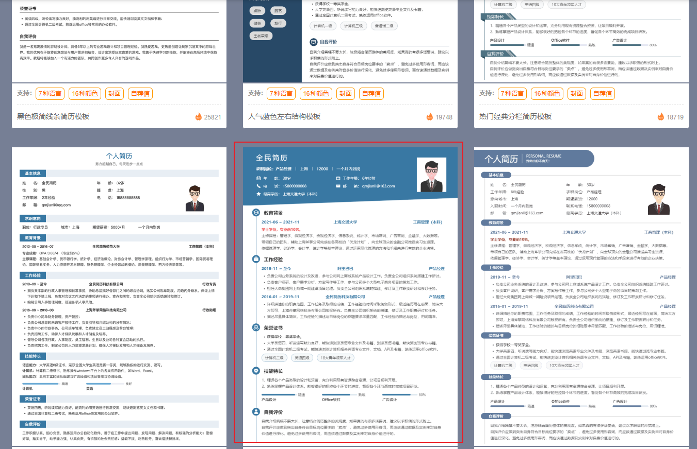

- [简历准备](#简历准备)
  - [简历准备工作](#简历准备工作)
  - [前端工程师简历模块](#前端工程师简历模块)
    - [个人信息](#个人信息)
    - [求职意向](#求职意向)
    - [技术栈](#技术栈)
      - [中低端岗位](#中低端岗位)
      - [高端岗位](#高端岗位)
    - [教育经历](#教育经历)
    - [全名简历](#全名简历)
    - [项目经历](#项目经历)

# 简历准备

工作年限

14 级 15
高中 18
专科 20
本科 22

22
2025-1999 = 26
26-22 = 4 +1

> 工作年限 5 年
> 工作份数在 2 份最佳

工作就业年限及工作背景

- 国家企业信用信息公示系统
  [https://bt.gsxt.gov.cn/index.html]
  选取 【撤销登记（备案）公告】-》【撤销登记（备案）决定书公告】 中一家近期被撤销的公司

## 简历准备工作

- PDF 简历
  - **全民简历**
  - 五百丁
  - 锤子简历
- 平台简历
  - **BOSS 直聘**
  - 智联招聘
  - 拉钩

## 前端工程师简历模块

### 个人信息

### 求职意向

1. 前端开发
2. 意向城市：xx
3. 期望薪资：15k

   1. 工作年限 3-5 年
   2. 所在城市
      职友集[https://www.jobui.com/salary/]-> 查询所在城市的薪资范围

      - 前端开发

        - --单位(k) ----------------- 开发经验(3-5 年)
        - --成都 -------------------- 郑州 -------------------------- 深圳 --------------------- 上海

          | 区县   | 月平均工资 | 区县       | 月平均工资 | 区县   | 月平均工资 | 区县     | 月平均工资 |
          | ------ | ---------- | ---------- | ---------- | ------ | ---------- | -------- | ---------- |
          | 双流区 | 15.5       | 经开区     | 15.0       | 南山区 | 23.8       | 长宁区   | 29.9       |
          | 郫都区 | 15.0       | 郑东新区   | 14.4       | 龙岗区 | 20.1       | 黄浦区   | 27.9       |
          | 武侯区 | 14.4       | 高新区     | 14.3       | 坪山区 | 21.4       | 杨浦区   | 26.7       |
          | 成华区 | 13.8       | 管城回族区 | 12.8       | 福田区 | 19.5       | 徐汇区   | 26.3       |
          | 青羊区 | 12.5       | 金水区     | 11.4       | 盐田区 | 18.9       | 虹口区   | 25.5       |
          | 高新区 | 12.5       | 中原区     | 11.1       | 罗湖区 | 17.9       | 闵行区   | 23.6       |
          | 锦江区 | 12.5       | 中牟县     | 10.8       | 宝安区 | 16.8       | 浦东新区 | 23.3       |

4. 入职时间：随时到岗

### 技术栈

全民简历叫技术特长

1. 改名叫“技术栈”
2. 移动到“求职意向”后面，保证放在“个人信息”或者“开源贡献”的下面

#### 中低端岗位

**框架方面**： 精通 Vue2/3 、React 等现代前端框架，理解两个框架之间的核心原理以及差异，拥有两大框架开发多个大型项目的开发经验，
对两大框架的周边生态（Vue Router、Vuex、Pinia、Vue I18n、Vant、Element UI、AntdV、React Router、Redux、Antdesign）有一定的使用心得和体会。

**工程化方面**：熟练掌握 Webpack、Vite、Rollup 等前端工程化工具，了解不同工具的核心原理以及差异，针对每种工具能实现自定义构建流程和打包优化。

**B 端开发经验**：拥有 PC、H5 项目的多种自适应方案及开发经验。

**C 端开发经验**：熟练使用 React native 开发 iOS 和安卓原生应用的开发经验。

**性能优化**：掌握前端常见性能优化手段，包括代码分割、懒加载、资源优化等技术，显著降低 FCP 和 LCP 时间，提升用户交互体验

**后端能力**：熟悉 Node.js 以及 Express 等框架，能够设计并实现 Restful 风格的 API,做到前后端分离。

**数据库方面**：熟悉 MySQL、SQLServer 数据库的基本使用，能够设计简单的数据库模型，进行数据的 CRUD 操作。

**设计模式**：熟悉 SOLID 设计原则以及前端常用设计模式，能够在合适的场景下应用这些模式，提高代码的可维护性和可扩展性。

**数据结构与算法**：了解基本的数据结构和算法，完成力扣前 100 道算法题。

**编码能力**：有用扎实的 HTML、CSS、JS 基础，针对部分前端核心知识有深入研究，研究结果已发布至 github、掘金等平台。

- 缺陷

  1. 降低 FCP 和 LCP 时间
  2. Node.js 以及 Express
  3. 设计并实现 Restful 风格的 API
  4. SOLID 设计原则以及前端常用设计模式
  5. 力扣前 100 道算法题

#### 高端岗位

**管理方面**：拥有管理 10+人前端团队经验，擅长团队建设和项目管理。负责制定技术规范和开发流程，准确分配任务并确保项目按时交付。善于通过代码评审、技术分享等方式提升团队整体技术水平，促进团队成员的技术成长。

**架构方面**：拥有自定义脚手架的能力，可以根据需求从 0 到 1 搭建整个 multirepo/monorepo 项目，包括但不限于前端工具链的选型、自定义构建工具的构建流程和打包优化、团队代码规范的制定以及相关工具的选型与配置。

**微前端**：拥有丰富的微前端架构经验，熟悉多种为前端实现方式，如 qiankun、wujie 等。能够将巨石应用重构为独立可部署的子应用，确保每个子应用的独立开发、测试和部署，提高团队的开发效率和项目的可维护性。

框架方面：精通 Vue2/3 、React 等现代前端框架，理解两个框架之间的核心原理以及差异，独立实现 mini 版 Vue 和 React,已开源至 Github 等平台。拥有两大框架开发多个大型项目的开发经验，对两大框架的周边生态（Vue Router、Vuex、Pinia、Vue I18n、Vant、Element UI、AntdV、React Router、Redux、Antdesign）有一定的使用心得和体会。

**工程化方面**：熟练掌握 Webpack、Vite、Rollup 等前端工程化工具，了解不同工具的核心原理以及差异，拥有编写 Webpack、Vite 插件的经验，插件已发布至 npm 上，服务于 4+项目。

单元测试：掌握 Jest、Viest 等前端流行测试框架，针对公共模块能够编写搞覆盖率的测试用例，提升代码健壮性。

C 端开发经验：熟练使用 UniAPP、Taro 等跨端框架或原生语法独立开发微信小程序，拥有使用 React native 开发 iOS 和安卓原生应用的开发经验，熟悉 Electron,能够运用 Electron 制作桌面端应用。

**性能优化**：掌握前端常见性能优化手段，包括代码分割、懒加载、资源优化、SSR 服务端渲染等技术，显著降低 FCP 和 LCP 时间，提升用户交互体验。

**后端能力**：熟悉 Node.js 以及 Express、Koa2、Egg.js 等框架，能够设计并落地 BFF 架构项目，实现从开发到部署完全的前后端分离。

**数据库方面**：熟悉 MySQL、SQLServer、MongoDB 数据库的基本使用，能够设计简单的数据库模型，进行数据的 CRUD 操作。

**设计模式**：熟悉 SOLID 设计原则以及前端常用设计模式，能够在合适的场景下应用这些模式，提高代码的可维护性和可扩展性。

**数据结构与算法**：了解基本的数据结构和算法，完成力扣前 200 道算法题。

**编码能力**：有用扎实的 HTML、CSS、JS 基础，针对部分前端核心知识有深入研究，研究结果已发布至 github、掘金等平台。熟练掌握 TypeScript，在项目中能够利用 TypeScript 进行类型检查和代码优化，提高代码的可维护性和可靠性。

- 缺陷：
  1. multirepo
  2. monorepo
  3. 前端工具链
  4. 自定义构建工具的构建流程
  5. mini 版 Vue 和 React
  6. 编写 Webpack、Vite 插件
  7. UniAPP、Taro
  8. 开发微信小程序
  9. Electron
  10. SSR 服务端渲染
  11. 降低 FCP 和 LCP 时间
  12. Node.js,Express、Koa2、Egg.js
  13. 设计并落地 BFF 架构项目
  14. MongoDB
  15. SOLID 设计原则
  16. 力扣前 200 道算法题
  17. qiankun、wujie 将巨石应用重构为独立可部署的子应用，确保每个子应用的独立开发、测试和部署

### 教育经历

- 专升本

  - 直接写本科，不写年限
  - BOSS 直聘：按照统招的年限填写

        > 本科 （增加沟通的机会，能够清楚的排除是不是学历被卡）

        > 主修课程：计算机基础、C/C++编程、Java 编程、数据结构、数据库系统、网络基础、软件工程以及前端开发技术。

        > 学历直接选本科

        > 学制类型选**全日制**

        > 入学时间：2017-09 毕业时间：2021-07

        > 工作年限：2021-07 至今 xx 年

        > 在校经历：计算机基础、C/C++编程、Java 编程、数据结构、数据库系统、网络基础、软件工程以及前端开发技术。

### 全名简历

1. 个人优势
   1. 有多个大型项目上线经验，拥有在高流量环境下的稳定性和应对能力。
   2. 通过自主研发和提升团队效率，提高了项目的维护成本。
   3. 有过 10 人以上的前端团队管理经验，擅长团队建设和项目管理。
2. 个人评价
   热衷于前端开发领域，不断扩展专业知识库，深入研读了众多前端技术书籍，包括但不限于《前端架构设计》、《前端工程化-体系设计与实践》、《深入浅出 Vue.js》等。无论面对何种新兴技术，始终保持积极态度，并通过阅读专业书籍以及相关视频，能够在一周内快速理解并应用这些技术。
3. 工作经历

抬头：

- 工作时间：要和后面的项目时间对应
- 公司名称: 最好写全称
- 职位：
  1. 前端开发工程师：负责项目普通开发
     1. 负责前端项目各业务模块的开发
     2. 配合后端开发人员进行接口联调
     3. 参与代码评审，确保代码质量和规范性，根据优化建议对代码进行优化
  2. 前端技术专家：专注于特定领域的前端技术，负责特定领域技术难题的解决
  3. 前端组长：领导和管理团队，分配任务并监督进度
     1. 负责前端技术选型、项目架构设计，并编写项目的代码规范文档。
     2. 攻关前端项目中的复杂模块，并解决其他模块前端技术难题。
     3. 负责前端团队的日常管理和技术培训，提升团队整体技术水平。
  4. 前端项目架构师：负责项目整体架构设计、技术栈和工具的选型和团队技术规范制定

### 项目经历

第三方平台：全民简历
简历模板： 第二排中间那个

颜色：统一选蓝色 代表科技性
